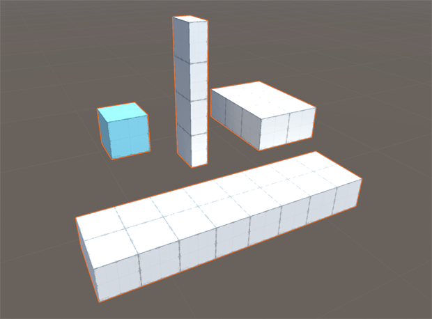
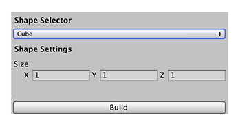

# Cube
A cube is the default shape in ProBuilder. It is a six-sided 3D square. To add a default cube to the Scene, you can use the **Ctrl/Cmd+K** keyboard shortcut.

The blue cube in this image is the default cube in preview mode.

You can customize the shape of a cube with these shape properties:

| **Property:** | **Description:** |
|:-- |:-- |
| __X__ | Set the dimensions in the x-axis of the cube (width) in meters. The default value is 1. The minimum value is 0.01. |
| __Y__ | Set the dimensions in the y-axis of the cube (height) in meters. The default value is 1. The minimum value is 0.01. |
| __Z__ | Set the dimensions in the z-axis of the cube (depth) in meters. The default value is 1. The minimum value is 0.01. |
