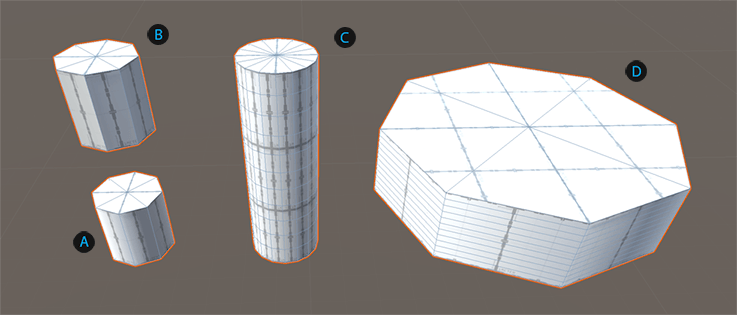
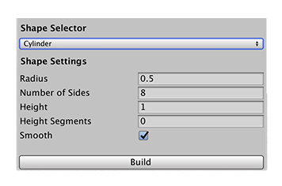

# Cylinder
Cylinders are like pies that have been stretched along the y-axis: they have a radius and a height.

 Default cylinder shape

 Cylinder without the smoothing

 Cylinder with a height of 3 and 16 sides

 Cylinder with a radius of 4 and 10 subdivisions

You can customize the shape of a cylinder with these shape properties:

| Property: | Description: |
|: |: |
| __Radius__ | Set the radius (width) of the cylinder. Default value is 0.5. Minimum value is 0.01. |
| __Number of Sides__ | Set the number of sides for the cylinder. The more sides you use (relative to the size of the __Radius__), the smoother the sides of the cylinder become. Default value is 8. Valid values range from 4 to 48. |
| __Height__ | Set the height of the cylinder. Default value is 1. |
| __Height Segments__ | Set the number of divisions to use for the height of the cylinder. For example, using a value of 3 produces 4 faces on every side of the cylinder. Default value is 0. Valid values range from 0 to 48. |
| __Smooth__ | Enable this option to smooth the edges of the polygons (the default). |
