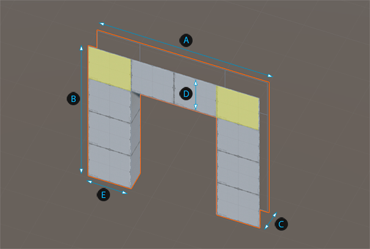
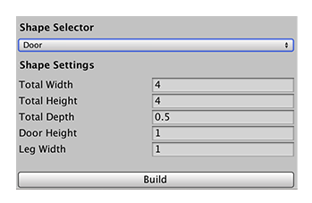

# Door
The ProBuilder door shape provides a convenient door Mesh that you can set into a level wall. There are no polygons where it meets the wall, so you can place it directly into the wall.

 Total Width

 Total Height

 Total Depth

 Door Height

 Leg Width

You can customize the shape of a door with these shape properties:

| **Property:** | **Description:** |
|:-- |:-- |
| __Total Width__ | Set the total width of the door in meters. The default value is 4. The minimum value is 1. |
| __Total Height__ | Set the total height of the door in meters. The default value is 4. The minimum value is 1. |
| __Total Depth__ | Set the depth of the wall that separates the two rooms in meters. The default value is 0.5. The minimum value is 0.01. |
| __Door Height__ | Set the height of the top of the door frame in meters. The default value is 1. The minimum value is 0.01. |
| __Leg Width__ | Set the width of the door frame on the sides in meters. The default value is 1. Valid values range from 0.01 to half of the __Total Width__ value. |
