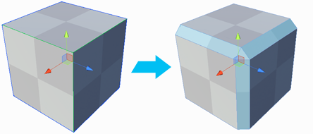
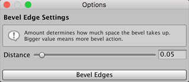

#  Bevel Edge

The __Bevel Edge__ tool splits the selected edge(s) into two edges, with a new face between.

## Bevel Options

To change the width of the bevel, change the __Distance__ to move the newly created edge(s) from the position of the original edge(s). This becomes the width of the new face(s).

