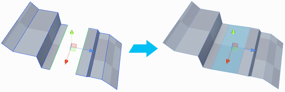

#  Bridge Edges

Creates a new face between two selected edges. 

By default, this tool can only bridge two open edges (that is, no face on the *open* or *free* side). However, you can override this by enabling the [Allow non-manifold actions](preferences.md#bridge) preference.

> ***Tip:*** You can also use this tool with the **Alt+B** (Windows) or **Opt+B** (Mac) hotkey.

