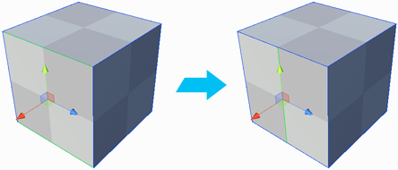

#  Connect Edges

The __Connect Edges__ tool inserts an edge that connects the centers of each selected edge.

> **Tip:** You can also use this tool with the **Alt/Opt+E** hotkey.

If you select more than two edges, ProBuilder creates as many new edges as possible without creating bad geometry. 

You can connect across several faces, as long as they share a selected edge.

