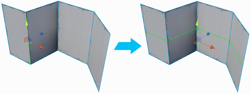

#  Insert Edge Loop

Adds a new edge loop from the selected edge(s). An edge loop is a series of edges that are directly connected, often encircling a 3D object and connecting back at the origin point.

> ***Note:*** Loops only continue through quads (four-sided polygons), not triangles.

> ***Tip:*** You can also use this tool with the **Alt+U** (Windows) or **Opt+U** (Mac) hotkey.

This creates more geometry than using [Connect Edges](Edge_Connect.md) or [Connect Vertices](Vert_Connect.md) but it makes the geometry cleaner. For example, if you insert an edge on a single face of a cube you get a T-junction, but if you insert an edge loop instead, you get the same geometry all around the cube, provided that the loop is only passing through quads.

You can always use this **Insert Edge Loop** until you are finished editing your geometry and then at the end delete the extra unnecessary edges to optimize the geometry.

