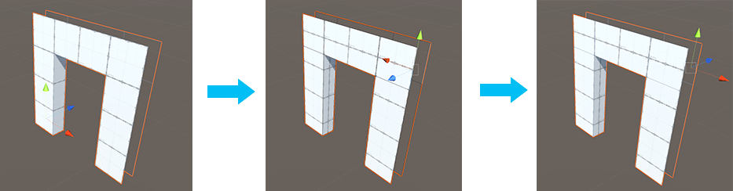

#  Set Pivot (Edges)

Move the pivot point of this Mesh to the average center of the selected edges.

> ***Tip:*** You can also use this tool with the **Ctrl+J** (Windows) or **Cmd+J** (Mac) hotkey.

In the first panel of this example, the pivot point of the door is at its left bottom leg. The middle panel shows two edges selected on the opposite side. The Set Pivot tool changes the pivot to the center of those top edges. The third panel displays the pivot point at the top right, even when back in Object editing mode.