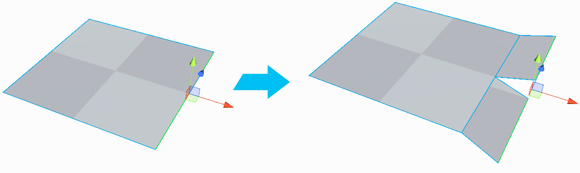
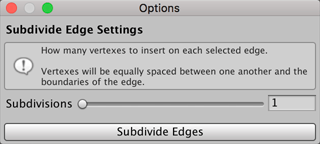

#  Subdivide Edge

Divides the selected edge(s) into multiple edges. By default, ProBuilder splits the edge in two, but you can set your own number of __Subdivisions__ in the Options window.

> ***Tip:*** You can also use this tool with the **Alt+S** (Windows) or **Opt+S** (Mac) hotkey.

## Subdivide Edge Options

You can change the number of new edges created by changing the __Subdivisions__ option. By default, the number of subdivisions is **1**, which means that ProBuilder splits a single selected edge into two edges. If you change this value to **3**, then a single edge becomes four edges. 

The range of valid values is **1** to **32**.

