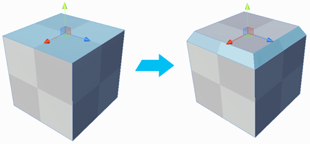

#  Bevel (Faces)

Performs the [Bevel Edge](Edge_Bevel.md) action on all the edges of the selected face(s).

## Bevel Options

You can control the width of the bevel by changing the __Distance__ to move the newly created edge(s) from the position of the original edge(s). This becomes the width of the new face(s).

