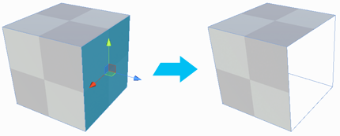

#  Delete Faces

Deletes the selected face(s).

> ***Tip:*** You can also use this tool with the **Backspace** hotkey. If you forget and use **Delete** instead, this deletes the entire Mesh, but you can use Undo to reverse it.

