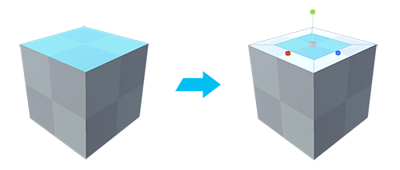

# Inset

To create a new face set into the currently selected face, you can use the [Extrude Faces](Face_Extrude.md) tool and scale the extruded face. 

Inset faces give you a lot of flexibility for building more sophisticated shapes. For example, you can extrude an inset face inwards to create interior walls, or extrude outwards for a more detailed exterior. 

To create an inset face: 

1. Activate the [Face mode](modes.md).
2. Select the face you want to add the inset to.
3. Activate the [Scale tool](https://docs.unity3d.com/Documentation/Manual/PositioningGameObjects.html).
4. Hold **Shift** and scale along either axis of the face, and let go when you are satisfied. For example, if you want to inset the top face of a cube, you can scale along either the x-axis or the z-axis.
5. Scale along the other axis of the face to complete the inset. For example, if you extruded along the z-axis in step 4, then scale in the x-axis. 
