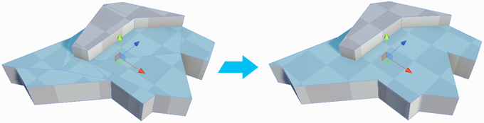

#  Merge Faces

The __Merge Faces__ tool merges selected faces into a single face, and removes any dividing edges.

> **Caution:** Be careful when you merge two unconnected faces, because this can produce unexpected results with any texture mapping. This tool can sometimes create unusual geometry artifacts, such as [vertices at T-junctions](workflow-edit-tips.md#tjoint) or [floating (winged) vertices](workflow-edit-tips.md#floatv) (that is, unused vertices sitting on an edge with no other edge passing through it). It is better to merge faces only when really necessary.

