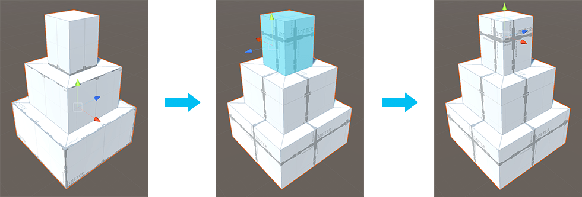

#  Set Pivot (Faces)

Move the pivot point of this Mesh to the average center of the selected faces.

> ***Tip:*** You can also use this tool with the **Ctrl+J** (Windows) or **Cmd+J** (Mac) hotkey.

In the first panel of this example, the pivot point of the block tower is at the center of the entire Mesh. The middle panel shows the top faces selected so the Set Pivot tool changes the pivot to the center of those top faces. The third panel demonstrates where the pivot point is now, even when in Object editing mode.