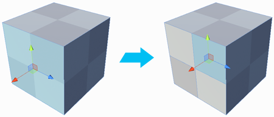

#  Subdivide Faces

Splits each selected face by adding a vertex at the center of each edge and connecting them in the center.

> ***Tip:*** You can also use this tool with the **Alt+S** (Windows) or **Opt+S** (Mac) hotkey.

This allows you to add a lot more detail to your geometry.

