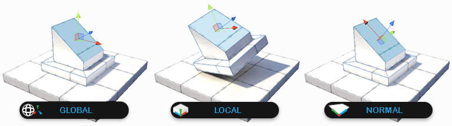

#  Orientation

Sets how the scene handles are oriented when selecting [objects and elements](modes.md). 

Clicking this button switches between the three states:

This tool is available in all [edit modes](modes.md).

> ***Tip:*** You can also use this tool with the **P** hotkey.

## Visual cues

Depending whether you are in [text mode or icon mode](toolbar.md#buttonmode), the button displays the following to indicate what state the tool is in:

| ***Icon mode:***                                             | *Text mode:*            | ***Description:***                                           |
| :----------------------------------------------------------- | ----------------------- | ------------------------------------------------------------ |
|  | **Orientation: Global** | Similar to a compass, the handle orientation is always the same, regardless of local rotation. |
|  | **Orientation: Local**  | Similar to *left vs right*, handle orientation is relative to the object's rotation. |
|  | **Orientation: Normal** | Special mode that aligns the handles to the exact normal direction of the selected face. |

