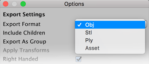
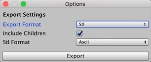
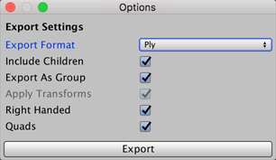
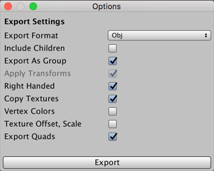

#  Export

[Exports](workflow-exporting.md#export) the selected ProBuilder object(s) to a 3D Model file. 

For an overview of exporting ProBuilder objects and and re-importing the exported files, see [Exporting and re-importing](workflow-exporting.md).

## Export options

Select the [format you want to export to](workflow-exporting.md#formats) from the **Export Format** drop-down menu. Depending on which format you choose, different options are available:

* [OBJ-specific options](#Obj)
* [STL-specific options](#STL)
* [PLY-specific options](#PLY)
* [Asset-specific options](#Asset)

The one option that applies to all file format types is the __Include Children__ property, which you can enable  to include not only selected Meshes, but also the children of selected objects in the exported Model. 

### Asset-specific options

For the Asset format type, the __Include Children__ property is the only available option.

### STL-specific options

The STL format type also provides the __STL Format__ option, which allows you to choose whether to use the **ASCII** or **Binary** representation of the STL file specification. 

### PLY-specific options

| ***Property:***      | ***Description:***                                           |
| :------------------- | :----------------------------------------------------------- |
| __Export as Group__  | Enable this option to combine all selected objects and export them as a single Model file. Otherwise, ProBuilder exports each Mesh separately. |
| __Apply Transforms__ | Enable this option to apply the GameObject transform to the Mesh attributes before exporting. With this option and **Export as Group** enabled, you can export your whole Scene, edit, then re-import it with everything exactly where you left it. |
| __Right Handed__     | Enable this option to use right-handed coordinates. Unity's coordinate system is left-handed, but most major 3D modeling software applications operate using right-handed coordinates. |
| __Quads__            | Enable this option to preserve quads where possible.         |

### OBJ-specific options

| ***Property:***           | ***Description:***                                           |
| :------------------------ | :----------------------------------------------------------- |
| __Export as Group__       | Enable this option to combine all selected objects and export them as a single Model file. Otherwise, ProBuilder exports each Mesh separately. |
| __Apply Transforms__      | Enable this option to apply the GameObject transform to the Mesh attributes before exporting. With this option and **Export as Group** enabled, you can export your whole Scene, edit, then re-import it with everything exactly where you left it. |
| __Right Handed__          | Enable this option to use right-handed coordinates. Unity's coordinate system is left-handed, but most major 3D modeling software applications operate using right-handed coordinates. |
| __Copy Textures__         | Enable this option to copy texture maps to the file destination and reference them from local paths in the Material library.  Disable it if you want the Material library to reference an absolute path to the Textures instead of copying them. See [Re-importing an exported Mesh](workflow-exporting.md#reimport) for more information. |
| __Vertex Colors__         | Enable this option to Some 3D modeling applications can import vertex colors from an unofficial extension to the OBJ format. Toggling this will write vertex colors using the MeshLab format. This can break import in some applications, please use with caution! |
| __Texture Scale, Offset__ | Enable this option to Some 3D modeling applications import texture scale and offset paramters (Blender, for example). Toggling this will write these values to the exported mtlib file. This can break import in some applications, please use with caution! |
| **Export Quads**          | Enable this option to preserve quads where possible.         |

