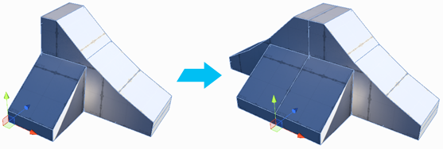
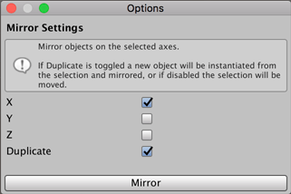

#  Mirror Objects

Creates mirrored copies of objects.

Mirroring is especially useful when creating symmetrical items. You can build one half, mirror it, and then weld the two Meshes together for a perfectly symmetrical result.

## Mirror Options

| ***Property:*** | ***Description:***                                           |
| :-------------- | :----------------------------------------------------------- |
| __X, Y, Z__     | Check each axis you want to mirror on. You can choose one axis only, or multiple axes. |
| __Duplicate__   | Enable this option to create a duplicate object and mirror it, leaving the original unchanged. |

When you are finished setting these properties, click **Mirror**.

