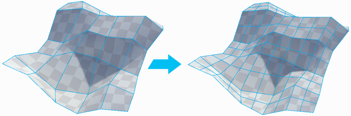

#  Subdivide Object

The __Subdivide Object__ tool divides every face on selected objects, allowing for greater levels of detail when modeling.

To do this, for each face, it adds a vertex at the center of each edge and connects them in the center of the face.