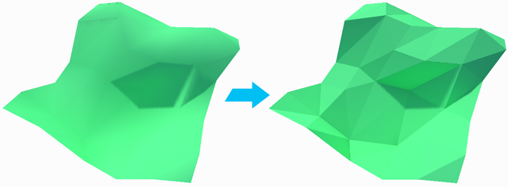

#  Triangulate (Objects)

The __Triangulate__ tool reduces all polygons to their base triangles. This creates a sharp, faceted appearance.

**Note:** To smooth some of the hard edges, you can [add and remove smoothing groups](workflow-edit-smoothing.md) across the faces of the Mesh.