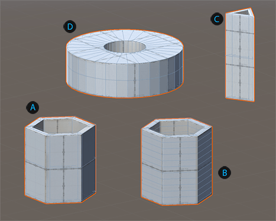
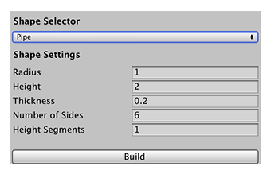

# Pipe
The pipe shape is like a hollow cylinder. Its properties are basically the same as the cylinder's but you can also specify the thickness of the pipe wall.

 Basic pipe shape (default values)

 Pipe with increased number of height segments (faces per side)

 Pipe with three sides and increased height

 Pipe with increased number of sides and thickness

You can customize the shape of a pipe with these shape properties:

| Property: | Description: |
|: |: |
| __Radius__ | Set the radius (width) of the pipe. Default value is 1. Minimum value is 0.1. |
| __Height__ | Set the height of the pipe. Default value is 2. Minimum value is 0.1. |
| __Thickness__ | Set the thickness of the walls of the pipe. As this value approaches the __Radius__ value, the hole becomes smaller. Default value is 0.2. Valid values range from 0.01 to the __Radius__ value minus 0.01. |
| __Number of Sides__ | Set the number of sides for the pipe. The more sides you use (relative to the size of the __Radius__), the smoother the sides of the pipe become. Default value is 6. Valid values range from 3 to 32. |
| __Height Segments__ | Set the number of divisions to use for the height of the pipe. For example, using a value of 3 produces four faces on every side of the pipe. Default value is 1. Valid values range from 0 to 32. |
