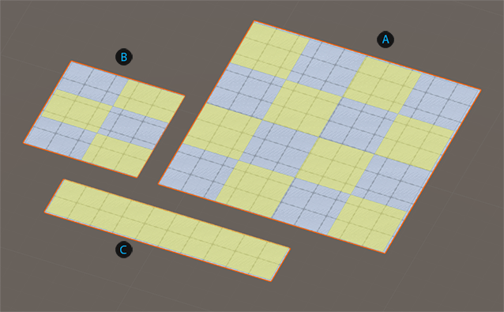
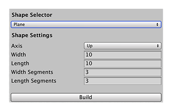

# Plane
A plane is a four-sided 2D shape. It can be a square or a rectangle, with two dimensions (width and height) in any orientation.

 Default plane: height and width both set to a size of 10 units, and 3 subdivisions

 Square plane with 2 subdivisions along the width and 1 along the length 

 Rectangular plane (10 x 2) with no subdivisions

You can customize the shape of a plane with these shape properties:

|**Property:** ||**Function:** |
|:---|:---|:---|
| __Axis__ || Choose the starting orientation for the plane. Default value is *Up*. |
||*Right*|Width is along the the z-axis, height is along the the y-axis, normals point towards the X-axis in the positive direction.|
||*Left*|Width is along the the y-axis, height is along the the z-axis, normals point towards the X-axis in the negative direction.|
||*Up*|Width is along the the X-axis, height is along the the z-axis, normals point towards the y-axis in the positive direction.|
||*Down*|Width is along the the z-axis, height is along the the X-axis, normals point towards the y-axis in the negative direction.|
||*Forward*|Width is along the the y-axis, height is along the the X-axis, normals point towards the z-axis in the positive direction.|
||*Backward*|Width is along the the X-axis, height is along the the y-axis, normals point towards the z-axis in the negative direction.|
| __Width__ || Set the width of the plane in meters. The default value is 10. The minimum value is 1. |
| __Length__ || Set the length of the plane in meters. The default value is 10. The minimum value is 1. |
| __Width Segments__ || Set the number of divisions to use for the width of the plane. For example, if you use a value of 3, ProBuilder produces a plane with four "columns". If you specify 3 for both the __Width Segments__ and __Length Segments__, ProBuilder builds a plane with 16 faces. The default value is 3. The minimum value is 0. |
| __Length Segments__ || Set the number of divisions to use for the length of the plane. For example, using a value of 3 produces four "rows". If you specify 2 for both the __Width Segments__ and 1 for the __Length Segments__, ProBuilder builds a plane with six faces. The default value is 3. The minimum value is 0. |
