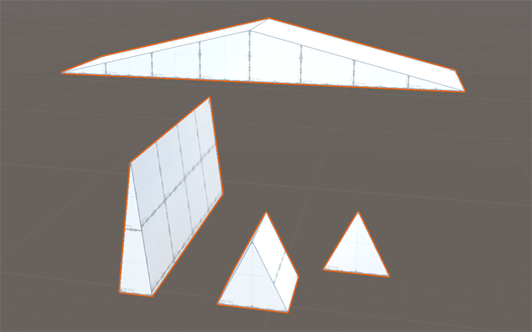
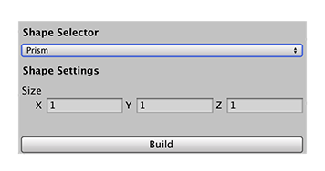

# Prism
A prism is a shape with two identical ends and flat sides. The basic ProBuilder prism is like a three-dimensional triangle, stretched along the z-axis.

You can customize the shape of a prism with these shape properties:

| **Property:** | **Description:** |
|:-- |:-- |
| __X__ | Set the dimensions in the x-axis of the prism (the base of the triangle) in meters. The default value is 1. The minimum value is 0.01. |
| __Y__ | Set the dimensions in the y-axis of the prism (the height of the prism) in meters. The default value is 1. The minimum value is 0.01. |
| __Z__ | Set the dimensions in the z-axis of the prism (the amount you want to stretch the triangle) in meters. The default value is 1. The minimum value is 0.01. |
