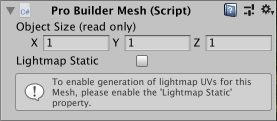
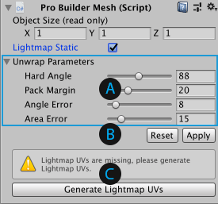

# Pro Builder Mesh component

This component appears on any ProBuilder Mesh GameObject. It displays the **Object Size** of the ProBuilder Mesh in **X**, **Y**, and **Z**. It also allows you to generate lightmap UVs for the Mesh, and customize how ProBuilder generates them. 

 

## Lightmap UVs and their parameters

To customize and generate lightmap UV parameters for this Mesh, enable the **Lightmap Static** option. A new section appears below the option.

 

 The **Unwrap Parameters** section contains standard UV parameters for [Generating Lightmap UVs](https://docs.unity3d.com/Manual/LightingGiUvs-GeneratingLightmappingUVs.html) on this ProBuilder Mesh.

 Click the **Apply** button to save (or the **Reset** button to discard) the modifications you made to the **Unwrap Parameters** section.

 If your Mesh is missing lightmap UVs, a warning message appears. Click the **Generate Lightmap UVs** button to regenerate the lightmap UVs for this Mesh. The message and the button disappears as soon as ProBuilder regenerates the UVs.

