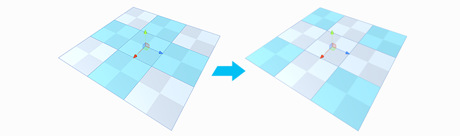

#  Invert Selection

Selects the inverse of the current selection: all unselected elements become selected, while the current selection becomes unselected.

This tool is available in the [vertex, edge, and face modes](modes.md).

> ***Tip:*** You can also use this tool with the **Ctrl+Shift+I** (Windows) or **Cmd+Shift+I** (Mac) hotkey or from the ProBuilder menu (**Tools** > **ProBuilder** > **Selection** > **Invert Selection**).

