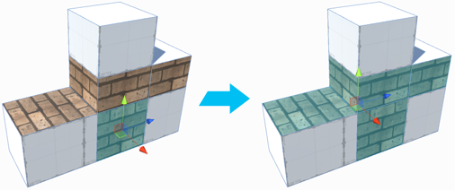
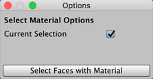

#  Select by Material

Selects all faces on this object which have the same Material as the selected face(s). You can also extend the selection to other GameObjects if you disable the **Current Selection** option.

This tool is useful for replacing all Materials on a complex object. It is available only in the [face mode](modes.md).

> ***Tip:*** You can also access this tool from the ProBuilder menu (**Tools** > **ProBuilder** > **Selection** > **Select Material**).

## Select by Material Options

By default, the **Current Selection** option is enabled. This means that ProBuilder extends the selection to other faces on the currently selected GameObject only. 

Disable this option if you want to select every face that has matching Material on any GameObject in the Scene. For example, you could replace this Material with another on every GameObject in the Scene at once.

 