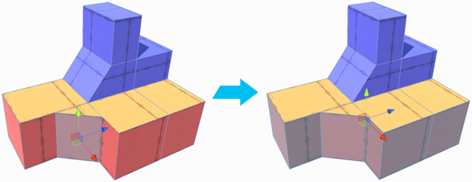
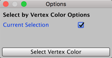

#  Select by Colors

The __Select by Vertex Color__ selects all faces on this object which have the same vertex color as the selected face. You can also extend the selection to other GameObjects if you disable the **Current Selection** option.

Even if the vertex color isn't currently visible (for example, if it has a Material that doesn't show colors, like the checkerboard Material), the colored faces are still selected.

This tool is useful for grouping out sections of your Mesh with different vertex colors. It is available in the [vertex, edge, and face modes](modes.md).

> **Tip:** You can also access this tool from the ProBuilder menu (**Tools** > **ProBuilder** > **Selection** > **Select Vertex Color**).

## Select by Colors Options

By default, the **Current Selection** option is enabled. This means that ProBuilder only extends the selection to other faces on the currently selected GameObject. 

Disable this option if you want to select every face with the currently selected vertex color on any GameObject in the Scene. 

 

