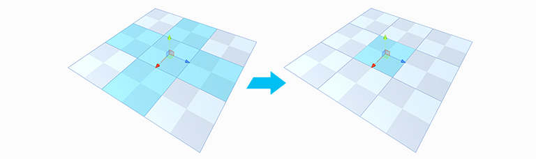

#  Shrink Selection

Removes the elements on the perimeter of the current selection ([Grow Selection](Selection_Grow.md) in reverse).

This tool is available in the [vertex, edge, and face modes](modes.md).

> ***Tip:*** You can also use this tool with the **Alt+Shift+G** (Windows) or **Opt+Shift+G** (Mac) hotkey or from the ProBuilder menu (**Tools** > **ProBuilder** > **Selection** > **Shrink Selection**).
