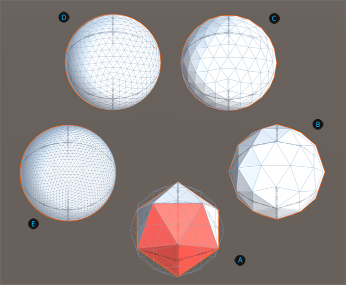
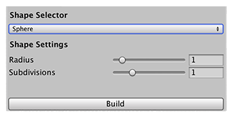

# Sphere
A sphere is actually a polygon with 42 vertices, and each vertex is shared by five triangles (faces).

 Sphere shape with no subdivisions showing five triangles colored. Superimposed on that shape is a wireframe of a default sphere (the same radius but with one subdivision.

 Default sphere shape (one subdivision).

 Sphere with two subdivisions.

 Sphere with three subdivisions.

 Sphere with four subdivisions.

You can customize the shape of a sphere with these shape properties:

| Property: | Description: |
|: |: |
| __Radius__ | Set the radius (size) of the sphere. Default value is 1. Valid values range from 0.01 to 10. |
| __Subdivisions__ | Set the number of times to subdivide each triangle. Default value is 1. Valid values range from 0 to 4.  The more subdivisions you create, the smoother the sphere appears. However, remember that each subdivision increases the number of triangles exponentially, which means that it uses a lot more resources to render. |
