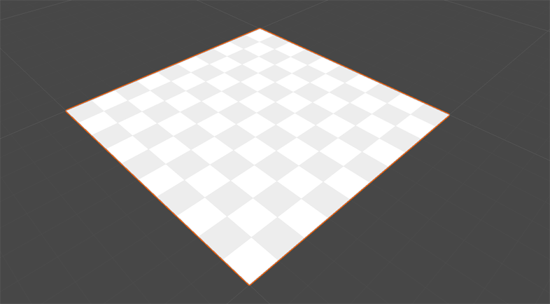
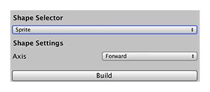

# Sprite
In ProBuilder, a sprite shape is a [plane](Plane.md) with all values set to 1 unit. 

To customize the rotation of the sprite when you first create it, use the __Axis__ property.

|**Property:** ||**Function:** |
|:---|:---|:---|
| __Axis__ || Choose the starting orientation for the plane. Default value is *Up*. |
||*Right*|Width is along the the z-axis, height is along the the y-axis, normals point towards the X-axis in the positive direction.|
||*Left*|Width is along the the y-axis, height is along the the z-axis, normals point towards the X-axis in the negative direction.|
||*Up*|Width is along the the X-axis, height is along the the z-axis, normals point towards the y-axis in the positive direction.|
||*Down*|Width is along the the z-axis, height is along the the X-axis, normals point towards the y-axis in the negative direction.|
||*Forward*|Width is along the the y-axis, height is along the the X-axis, normals point towards the z-axis in the positive direction.|
||*Backward*|Width is along the the X-axis, height is along the the y-axis, normals point towards the z-axis in the negative direction.|
