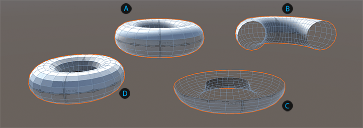
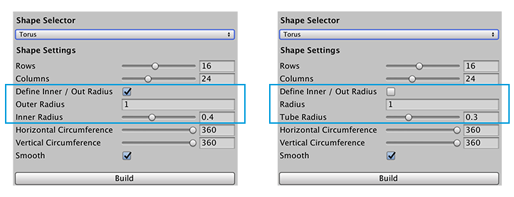

# Torus
A torus is a 3D shape formed by a small circle that rotates around a bigger circle. It usually looks like a circular ring, or a donut.

 Default torus (smooth)

 Torus with 180-degree horizontal circumference

 Torus with 180-degree vertical circumference

 Torus without smoothing

You can customize the shape of a torus with these shape properties:

| **Property:** | **Description:** |
|:-- |:-- |
| __Rows__ | Set the complexity of the Mesh, together with the __Columns__ value. You can enter a value from 3 to 32. The higher the value, the smoother the shape, but at the cost of more polygons to calculate. The default value is 16. |
| __Columns__ | Set the complexity of the Mesh, together with the __Rows__ value. You can enter a value from 3 to 64. The higher the value, the smoother the shape, but at the cost of more polygons (and therefore more computation). The default value is 24. |
| __Define Inner / Out Radius__ | Enable this option if you want to specify the value for the inner radius. Disable this option if you want to specify the value for the radius of the tube instead.   When you enable this option, the __Radius__ property becomes the __Outer Radius__ property, and the __Tube Radius__ property becomes the __Inner Radius__ property. |
| __Outer Radius__ | Set the amount of the outer radius in meters. Default value is 1.  **Note:** This property is only available when the __Define Inner / Out Radius__ property is enabled. |
| __Inner Radius__ | Set the amount of the inner radius in meters. Valid values range from 0.0009999871 to the __Outer Radius__ value. Default value is 0.4.  **Note:** This property is only available when the __Define Inner / Out Radius__ property is enabled. |
| __Radius__ | Set the radius of the entire torus in meters. Default value is 1.  **Note:** This property is only available when the __Define Inner / Out Radius__ property is disabled. |
| __Tube Radius__ | Set the radius of the tube itself in meters. Valid values range from 0.01 to the __Radius__ value. The default value is 0.3.  **Note:** This property is only available when the __Define Inner / Out Radius__ property is disabled. |
| __Horizontal Circumference__ | Set the degree of the torus's circumference. For example, if you set this value to 180 (as the  image demonstrates), it looks like someone cut half of the torus away (like leaving half of a donut). Default value is 360 (full torus). |
| __Vertical Circumference__ | Set the degree of the tube's circumference. For example, if you set this value to 180 (as the  image demonstrates), it looks like a half-pipe. Default value is 360 (full tube). |
| __Smooth__ | Enable this option to smooth the edges of the polygons (the default). |

