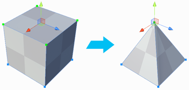
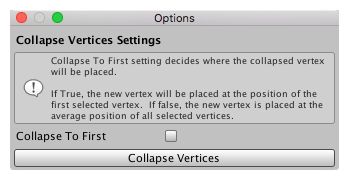

#  Collapse Vertices

The __Collapse Vertices__ tool collapses all selected vertices to a single point, regardless of distance. 

> **Tip:** You can also use this tool with the **Alt/Opt+C** hotkey.

ProBuilder uses the **Collapse To First** option to decide whether to collapse the vertices to a central point, or to the first selected vertex.

## Collapse Vertices Options

The **Collapse Vertices** tool determines where to locate the collapsed vertex in this way:

- If **Collapse To First** option is enabled, ProBuilder uses the location of the vertex that you selected first.
- Otherwise, ProBuilder calculates the center position between all selected vertices to use as the new location.

By default, the **Collapse To First** option is disabled, so ProBuilder uses the center position as in the example image above.

