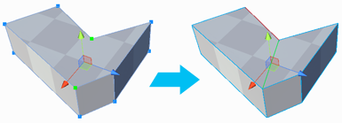

#  Connect Vertices

The __Connect Vertices__ tool creates a new edge that connects the selected vertices.

> **Tip:** You can also use this tool with the **Alt/Opt+E** hotkey.

If you select more than two vertices, ProBuilder creates as many new edges as possible, and adds extra vertices where necessary in order to keep the geometry valid. For example, if you connect three vertices around a quad, ProBuilder creates a new vertex in the middle to support the three new edges.

You can connect across several faces as long as they share a selected vertex.