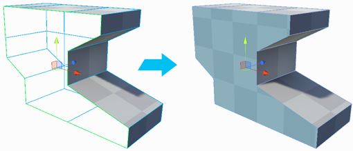
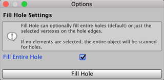

#  Fill Hole (Vertices)

Creates a new face filling any holes that touch the selected vertices.

## Fill Hole Options

Enable the __Fill Entire Hole__ option to fill the entire Mesh opening. This is the default.

If you disable this option, ProBuilder tries to build a Mesh between the selected open vertices. For example, if you have a missing quad, you can select any three adjacent vertices in order to create a triangular polygon that covers half of the hole. 

