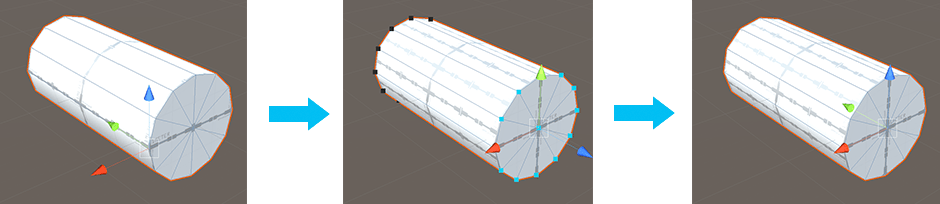

#  Set Pivot (Vertices)

Move the pivot point of this Mesh to the average center of the selected vertices.

> ***Tip:*** You can also use this tool with the **Ctrl+J** (Windows) or **Cmd+J** (Mac) hotkey.

In the first panel of this example, the pivot point of the log is at the end corner of the cylinder. The middle panel shows the vertices on the end selected so the Set Pivot tool changes the pivot to the center of those end vertices. The third panel displays the pivot point in the center of the cylinder end, even when back in Object editing mode.