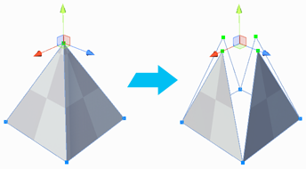

#  Split Vertices

Splits a vertex into individual vertices (one for each adjacent face) so that you can move the faces independently.

> ***Note:*** When a vertex splits, the newly separated vertices remain in place. This image shows the vertices apart only to illustrate that the original vertex became four. 

> ***Tip:*** You can also use this tool with the **Alt+X** (Windows) or **Opt+X** (Mac) hotkey.

