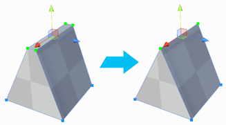
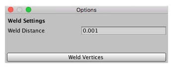

#  Weld Vertices

The __Weld Vertices__ tool merges selected vertices within a specific distance of one another. You can set this distance with the **Weld Distance** option.

> **Tip:** You can also use this tool with the **Alt/Opt+V** hotkey.

## Weld Vertices Options

ProBuilder uses the **Weld Distance** value to determine whether to weld any two vertices together. For example, you can use a very low number (such as the default value, **0.001**) to reduce vertices on a Mesh that are virtually occupying the same space.

With higher numbers, more vertices fit the criterion of *close enough to weld*. However, if you use a fairly low value, you can select more vertices than you intend to weld and still weld selected vertices that are close together. For example, in the image above, you could select all of the vertices and still achieve the same effect by using a **Weld Distance** of **0.25**.

