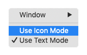
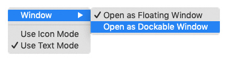
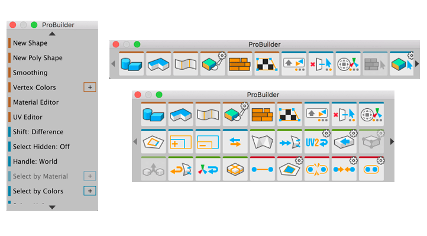

# Customizing ProBuilder

There are a number of ways to customize the way you work with ProBuilder. You can set preferences on the [ProBuilder Preferences](preferences.md) window:

* [Experimental](preferences.md#experimental): Toggle ProBuilder beta features.
* [General](preferences.md#general): This section contains a variety of settings, many of which control what information appears in the Scene view (see [Interaction and display](#toolbar)).
* [Graphics](preferences.md#graphics): Mostly these settings control the look of Unity (see [Interaction and display](#toolbar)).
* [Mesh Editing](preferences.md#mesh-editing): Define behavior specific to editing Meshes.
* [Mesh Settings](preferences.md#mesh-settings): Define defaults for ProBuilder Meshes (such as default Material, collider type, and shadows).
* [Shortcuts](preferences.md#shortcuts): Change the default key mappings for [ProBuilder hotkeys](hotkeys.md).
* [Toolbar](preferences.md#toolbar): Customize how the toolbars appear. See [below](#toolbar) for details.
* [UV Editor](preferences.md#uv-editor): Change the size of the grid on the [UV Editor](uv-editor.md) window.

In addition, you can limit the types of [messages](#logging) ProBuilder displays in the Console and whether to write them to a file. 

## Logging

You can choose what types of messages ProBuilder should log, and where the messages should appear. For example, you can set up logs to appear in your Unity console, to a log file locally, or both at the same time. You can also limit the log to only error messages, warning messages, debug messages, basic information, or any combination of these messages types. 

For details, see the documentation on the [Debug menu](menu-debug.md).

## Interaction and display

ProBuilder can display information about the Meshes in your Scene. For example, you can see the dimensions of your Mesh with [Dimensions Overlay](menu-dimover.md). You can also enable [Show Scene Info](preferences.md#info_overlay) to see how many vertices, edges, and faces are in the Scene and which are currently selected. ProBuilder can echo the name of the action you are performing if you enable the [Show Action Notifications](preferences.md#general) preference.

You can use the Unity color scheme, or disable the [Use Unity Colors](preferences.md#unitycolors) preference to set your own colors for the ProBuilder geometry elements. When disabled, a number of other properties appear that allow you to set the colors for the **Wireframe** and the hover color (**Preselection**). You can also define distinct colors for vertices, edges, and faces in both selected and unselected states. You can also change the size of the points that appear for vertices (**Vertex Size**), and the lines that appear for edges or wireframe (__Line Size__). 

In addition, you can customize several things about any of the toolbars that ProBuilder provides:

* You can [dock the toolbar or let it float](#dock) over the Unity window.
* You can [resize the toolbar](#resize) both horizontally and vertically. 

You can also choose whether to display [text or icons](toolbar.md#buttonmode) on the ProBuilder toolbar.

### Text vs Icon mode

To define whether ProBuilder displays [text or icons](toolbar.md#buttonmode) for each tool:

1. Right-click on any empty space in the toolbar. 

	

2. Choose either **Use Text Mode** or **Use Icon Mode** from the context menu.

> **Note:** You can also use the __Use Icon GUI__ option in the [ProBuilder Preferences](preferences.md#icongui) window.

### Floating vs Dockable

To change whether the toolbar [docks or floats](https://docs.unity3d.com/Manual/CustomizingYourWorkspace.html) in the Scene view:

1. Right-click on any empty space in the toolbar.

  

2. Choose either **Open As Floating Window** or **Open As Dockable Window** from the **Window** submenu of the context menu.

### Resizing the toolbar

To resize the ProBuilder toolbar, click and drag the corners and sides of the toolbar until it is at the right size and shape. 

ProBuilder re-orders the icon or text contents to best fit the window size.

