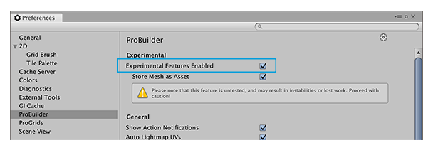

# Experimental features

ProBuilder has some additional features that are considered experimental:

- [Bezier Shape Tool](bezier.md)
- [Boolean (CSG) Tool](boolean.md)

These features are still under development, and may reduce ProBuilder's stability. Please use with caution.

By default, experimental features are disabled. 

To enable them, enable the [Experimental Features](preferences.html#experimental) preference.

