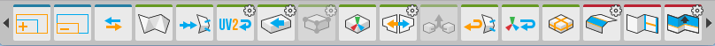

<h1>Getting Started with ProBuilder</h1>

First time using ProBuilder? Start here for an overview of creating your first mesh, editing geometry,
applying materials, and UV editing.

<iframe class="youtube-preview" width="560" height="315" src="https://www.youtube.com/embed/Ta3HkV_qHTc" frameborder="0" allow="autoplay; encrypted-media" allowfullscreen></iframe>

---

## The ProBuilder Toolbar

All of ProBuilder's editing functions are available via the [ProBuilder Toolbar](overview-toolbar), which dynamically adapts to your Edit Mode and selection.

Every toolbar button has a tooltip that will show a short summary about it's use. Viewing tooltips is a great way to start learning about ProBuilder's functionality.

## Creating a New Mesh

 Press `CTRL K` on your keyboard to spawn in a new ProBuilder-editable cube.

To help you get started, ProBuilder includes a library of additional shapes. Each shape is customizable with starting dimensions and a set of parameters. Access these shapes by pressing `CTRL SHIFT K` on your keyboard.

For more information, see [Shape Tool](tool-panels#shape-tool).

## Object vs Element

**Object Mode** is standard Unity mode, no surprises.

**Elements** are the individual parts that make up a mesh: **Vertices**, **Edges**, and **Faces**. Think of these like levels of detail on a map: city, state, country. An edge is made up of 2 vertices, a face is composed of 3 or more edges, and an object is the sum of all parts.

Click in the [Edit Mode Toolbar](overview-toolbar#edit-mode-toolbar) to change Mode, or use it's shortcut keys.

* __Vertex__: Select and edit Vertices for detailed editing and functions like vertex splitting and connecting.
* __Edge__: Select and edit Edges for semi-complex geometry editing, and Edge Loop Modeling techniques.
* __Face__: Select and edit Faces on an object, performing basic tasks like deleting faces and extruding.

### Element Selection and Manipulation

First, choose which element type you'd like to edit by clicking it's button in the [Edit Mode Toolbar](overview-toolbar#edit-mode-toolbar).

Then use any of the standard Unity selection methods (click, drag, etc) and manipulation controls just like you would on any other object(s).

### Building and Editing Complex Meshes

ProBuilder follows many of the same conventions as other 3D modeling applications, so experienced 3D artists will likely be able to jump right in after reading the [ProBuilder Toolbar](overview-toolbar) section.

If you are new to 3D modeling, ProBuilder is a great way to get your feet wet.  Now would be a good time to check out the tutorial videos on the ProCore [Youtube playlist](https://www.youtube.com/playlist?list=PLrJfHfcFkLM8PDioWg_5nmUqQycnVmi58).

## Texturing and UVs

### Applying Materials

You can apply **any** material to ProBuilder meshes using the [Material Palette](tool-panels#material-tools).

Materials can also be applied to individual faces of a ProBuilder mesh, while in [Element Mode](overview-toolbar#edit-mode-toolbar).

### Editing UVs

ProBuilder provides [automatic UV unwrapping](auto-uvs-actions), as well as a complete [manual UV editor](manual-uvs-actions).

**Auto UV** mode lets you tweak basics like offset, tiling, and rotation, while ProBuilder handles the complex UV work automatically.

**Manual UV** mode enables complete control of the UVs. With this workflow you can lay out your UV maps exactly how you want.

**You may use whichever you prefer, or a mix of both, even on the same mesh.**

For more information, see [Texturing and UVs](overview-texture-mapping)

