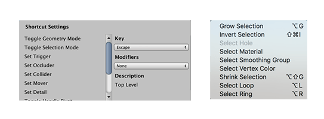

# ProBuilder hotkeys (keyboard shortcuts)

You can use **hotkeys** (keyboard shortcuts) to access many of the tools that are available from the toolbar and the menu. The menu items that have associated hotkeys display the key combinations in the menu. 

You can also change the default hotkeys on a few items on the [Shortcut Settings](preferences.md#shortcuts) section on the **ProBuilder Preferences** window.

This page gives an overview of the default ProBuilder keyboard shortcuts. Where a command has **Ctrl/Cmd** as part of the keystroke, use the **Control** key on Windows and the **Command** key on macOS. Similarly, where a command has **Alt/Opt** as part of the keystroke, use the **Alt** key on Windows and either the **Alt** or **Option** key on macOS, depending on your keyboard.

> **Note:** There are a few rare exceptions where a hotkey uses the **Control** key for both Windows and macOS. These exceptions are clearly indicated on the tool reference page and in the list below.

| **Key combination:**                                         | **Action:**                                                  |
| ------------------------------------------------------------ | ------------------------------------------------------------ |
| **Alt/Opt+Click(tool button)**                               | Open options for any tool on the toolbar.                    |
| **Alt/Opt+B**                                                | [Create a new face between two selected edges](Edge_Bridge.md). |
| **Alt/Opt+C**                                                | [Collapse the selected vertices](Vert_Collapse.md).          |
| **Alt/Opt+E**                                                | Create a new edge that connects either the [selected vertices](Vert_Connect.md) or the [centers of each selected edge](Edge_Connect.md), depending on what editing mode you are in. |
| **Alt/Opt+G**                                                | [Increase the number of items in the selection](Selection_Grow.md). |
| **Alt/Opt+J**                                                | Move the pivot to the [center](CenterPivot.md) of the currently selected vertices, edges, or faces. |
| **Alt/Opt+L**                                                | [Select edge loop](Selection_Loop_Edge.md).                  |
| **Alt/Opt+Shift+L+Double-Click**                             | [Select face loop](Selection_Loop_Face.md).                  |
| **Alt/Opt+R**                                                | [Select edge ring](Selection_Ring_Edge.md).                  |
| **Ctrl/Cmd+Shift+R+Double-Click**                            | [Select face ring](Selection_Ring_Face.md).                  |
| **Alt/Opt+S**                                                | [Divide the selected edges](Edge_Subdivide.md).              |
| **Alt/Opt+U**                                                | [Insert edge loop](Edge_InsertLoop.md).                      |
| **Alt/Opt+V**                                                | [Weld selected vertices](Vert_Weld.md).                      |
| **Alt/Opt+X**                                                | [Split the selected vertex](Vert_Split.md) into individual vertices (one per adjacent face). |
| **Alt/Opt+#**                                                | [Apply a specific Material](workflow-materials.md) to the selected object(s) or face(s). |
| **Alt/Opt+Shift+G**                                          | [Shrink the selection](Selection_Shrink.md).                 |
| **Backspace**                                                | Delete the selected [faces](Face_Delete.md) or [Bezier shape points](bezier.md). |
| **Esc**                                                      | Enable the _Object_ edit mode.                               |
| **B**                                                        | Set all selected objects to entity type _Brush_.             |
| **C**                                                        | Set all selected objects to entity type _Collider_.          |
| **G**                                                        | Toggle between the *Object* and *Element* (geometry) edit modes. |
| **H**                                                        | Cycle through _Vertex_, _Edge_, and _Face_ edit modes.       |
| **M**                                                        | Set all selected objects to entity type _Mover_.             |
| **O**                                                        | Set all selected objects to entity type _Occluder_.          |
| **P**                                                        | [Toggle the orientation](HandleAlign.md) of the ProBuilder selection handle. |
| **T**                                                        | Set all selected objects to entity type _Trigger_.           |
| **Ctrl+Click**                                               | [Align an adjacent face's UV coordinates](manual-uvs-actions.md#continue) to the current selection in the [UV Editor window](uv-editor.md).  ***Important:*** Unlike many other hotkey combinations involving the **Ctrl** key in Windows and the **Cmd** key in macOS, this tool works with only the **Ctrl** key for both platforms. |
| **Ctrl+Shift+Click**                                         | [Copy one face's UVs to another face](manual-uvs-actions.md#copy-uvs) to the current selection in the Scene view with the [UV Editor window](uv-editor.md) open.  **Important:** Unlike many other hotkey combinations involving the **Ctrl** key in Windows and the **Cmd** key in macOS, this tool works with only the **Ctrl** key for both platforms. |
| **Ctrl/Cmd+Drag** (while moving, rotating, or scaling) | Snap to UV increments in the [UV Editor window](uv-editor.md). |
| **Ctrl/Cmd+E**                                               | Extrude [edges](Edge_Extrude.md) and [faces](Face_Extrude.md) using the default options. |
| **Ctrl/Cmd+J**                                               | Move the pivot to the center of the currently selected elements:   - [Vertices](Vert_SetPivot.md)  - [Edges](Edge_SetPivot.md)  - [Faces](Face_SetPivot.md) |
| **Ctrl/Cmd+K**                                               | Create a [new Mesh cube](Cube.md).                           |
| **Ctrl/Cmd+Shift+I**                                         | [Invert the selection](Selection_Invert.md).                 |
| **Ctrl/Cmd+Shift+K**                                         | Open the [Shape tool window](shape-tool).                    |
| **Shift+Drag** (while moving, rotating, or scaling)          | Extrude [edges](Edge_Extrude.md) or [faces](Face_Extrude.md). |
| **Shift+Hover**                                              | Show tooltips when hovering over a tool icon in the ProBuilder toolbar. |

## Unique Mode Shortcuts

In addition, if you enable the [Unique Mode Shortcuts preference](preferences.md#unique), you can also use these shortcuts:

| Key combination: | Action:                    |
| :--------------- | -------------------------- |
| **H**            | Enable _Vertex_ edit mode. |
| **J**            | Enable _Edge_ edit mode.   |
| **K**            | Enable _Face_ edit mode.   |

> **Tip:** You can also change these default shortcut assignments in the [Shortcut Settings section](preferences.md#shortcuts) of the Preferences window.

