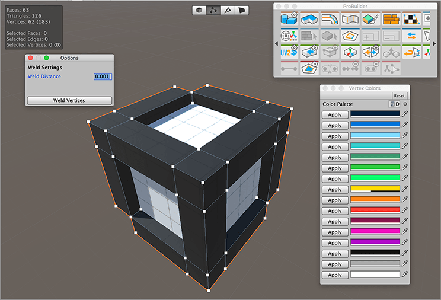

# About ProBuilder

You can build, edit, and texture custom geometry in Unity with the tools available in the ProBuilder package. You can also use ProBuilder to help with in-scene level design, prototyping, collision Meshes, and play-testing. 

ProBuilder also comes with a [Scripting API](api.md), so that you can write C# scripts to make your own tools and customizations.

Some of the advanced features include:

* [UV editing and texture mapping](workflow-texture-mapping.md)
* [Applying Vertex Colors](workflow-vertexcolors.md)
* [Creating parametric shapes](workflow-create.md)

In addition, the ProBuilder package includes a [Model export feature](workflow-exporting.md), which you can use to tweak your levels in any 3D modeling software.

## Document revision history

| Date | Reason | Version |
|:---|:---|:---|
| December 19, 2018 | Major restructuring, added overviews, verified package documentation to match version number. | 4.0.0 |
| May 15, 2018 | Edited, performed some restructuring. | 3.0.8 |
| Jan 31, 2018 | Installation instructions updated, minor tweaks to wording. | 3.0.0 |
| Nov 9, 2017 | Document created. | 2.9.8 |
