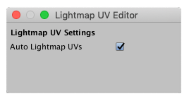

#  Lightmap UV Editor window

Use the __Auto Lightmap UVs__ option on this window to set whether or not you want ProBuilder to automatically rebuild lightmap UVs every time the Mesh changes for this Project. You can also toggle this setting on the [ProBuilder Preferences window](preferences.md#autouvs).

This is a very useful setting to enable, as it removes the burden of manually building lightmap UVs. However, this can also be very resource-intensive, especially for older or less-powerful systems. So, for performance reasons, you may want to disable this __Auto Lightmap UVs__ option and just use the [Lightmap UVs](Object_LightmapUVs.md) tool ( ) as needed.

> ***Tip:*** When one of the Meshes in any open Scene is missing lightmap UVs, the **Lightmap UV Settings** window displays a warning message and the **Build Missing Lightmap UVs** button. As soon as you click the button, ProBuilder builds the lightmap UVs and then hides the button and the message.

To open this window, launch the [toolbar option](overview-ui.md#pb_options) on the **Lightmap UVs** button ( ) from the [ProBuilder toolbar](toolbar.md).

> ***Tip:*** You can also access this window from the ProBuilder menu (**Tools** > **ProBuilder** > **Editors** > **Open Lightmap UV Editor**).

