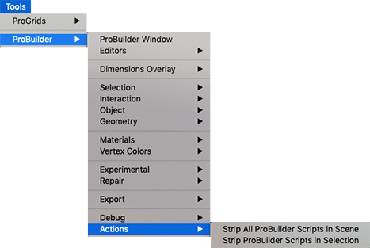

# Actions

This sub-menu provides access to editor and component windows.

## Strip All ProBuilder Scripts in Scene

Removes all ProBuilder scripts from all GameObjects in this Scene, leaving just the Models.

## Strip ProBuilder Scripts in Selection

Removes all ProBuilder scripts from selected GameObjects, leaving just the Model.