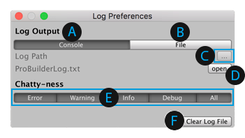

# Debug

This sub-menu provides access to the **Log Preferences** window, which allows you to customize how ProBuilder logs messages.

 Write messages to the **Console**. By default, this button is ON, indicated by a darker color.

 Write messages to a **File**. By default, this button is OFF, indicated by a lighter color.

 Click the file widget to select a folder for the log file. This widget is only available if the **File** button is ON.

 Click the **open** button to open the saved log file. This button is only available if the **File** button is ON.

 The **Chatty-ness** level defines which kind of messages ProBuilder logs. By default, ProBuilder logs everything, and all buttons are ON.

 Use the **Clear Log File** button to reset the saved log file by emptying all previously logged messages.

