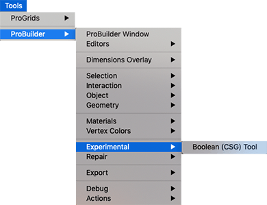

# Experimental

This sub-menu provides access to experimental tools.

Experimental tools are tools or functions that aren’t quite ready for public use, but are included for users to try out early, and report issues/feedback.

For more information, see the [Boolean](boolean.md) tool documentation.
