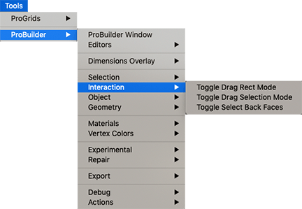

# Interaction

This sub-menu provides access to selection interaction tools.

## Toggle Drag Rect Mode

Use this to set the **Rect** tool to **Complete**: drag selection should only select elements inside the drag rectangle.

For more information, see the [Rect](Selection_Rect_Intersect.md) tool reference.

## Toggle Drag Selection Mode

Use this to set the **Rect** tool to **Intersect**: drag selection should select any elements that intersect with the drag rectangle.

For more information, see the [Rect](Selection_Rect_Intersect.md) tool reference.

## Toggle Select Back Faces

Use the **Select Hidden** tool to define whether hidden elements are selected or ignored, when drag-selecting.  

For more information, see the [Select Hidden](Selection_SelectHidden.md) tool reference.

