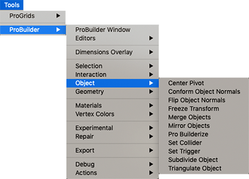

# Object

This sub-menu provides access to Object edit mode tools.

## Center Pivot

Use the **Center Pivot** tool to move the pivot point for the Mesh to the center of the object’s bounds.

For more information, see the [Center Pivot](CenterPivot.md) tool documentation.

## Conform Object Normals

Use the **Conform Normals** tool to set all face normals to the same relative direction.

For more information, see the [Conform Normals](Object_ConformNormals.md) tool documentation.

## Flip Object Normals

Use the **Flip Normals** tool to flip the normals of **all** faces on the selected object(s).

For more information, see the [Flip Normals](Object_FlipNormals.md) tool documentation.

## Freeze Transform

Use the **Freeze Transform** tool to set the selected object's position, rotation, and scale to world-relative origin.

For more information, see the [Freeze Transform](Freeze_Transform.md) tool documentation.

## Merge Objects

Use the **Merge Objects** tool to merge two or more selected ProBuilder GameObjects.

For more information, see the [Merge Objects](Object_Merge.md) tool documentation.

## Mirror Objects

Use the **Mirror Objects** tool to create mirrored copies of objects.

For more information, see the [Mirror Objects](Object_Mirror.md) tool documentation.

## Pro Builderize

Use the **ProBuilderize** tool to convert the selected object(s) into objects you can edit in ProBuilder.

For more information, see the [ProBuilderize](Object_ProBuilderize.md) tool documentation.

## Set Collider

Use the **Set Collider** tool to assign the **Collider Behaviour** script to selected objects.

For more information, see the [Set Collider](Entity_Trigger.md#Collider) tool documentation.

## Set Trigger

Use the **Set Trigger** tool to assign the **Trigger Behaviour** script to selected objects.

For more information, see the [Set Trigger](Entity_Trigger.md) tool documentation.

## Subdivide Object

Use the **Subdivide Object** tool to divide every face on selected objects.

For more information, see the [Subdivide Object](Object_Subdivide.md) tool documentation.

## Triangulate

Use the **Triangulate** tool to reduce all polygons to their base triangles.

For more information, see the [Triangulate](Object_Triangulate.md) tool documentation.
