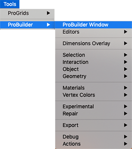

# The ProBuilder menu

Use the ProBuilder menu to access most of the ProBuilder editors and tools, and the special tools that are only available through this menu. For example, you can access tools to repair and debug ProBuilder, or access the experimental [Boolean](boolean.md) tool. 

The ProBuilder menu items include the following:

* [ProBuilder Window](menu-open.md)
* [Editors](menu-editors.md)
* [Dimensions Overlay](menu-dimover.md)
* [Selection](menu-selection.md)
* [Interaction](menu-interaction.md)
* [Object](menu-object.md)
* [Geometry](menu-geometry.md)
* [Materials](menu-materials.md)
* [Vertex Colors](menu-vertexcolors.md)
* [Experimental](menu-experimental.md)
* [Repair](menu-repair.md)
* [Export](menu-export.md)
* [Debug](menu-debug.md)
* [Actions](menu-actions.md)

