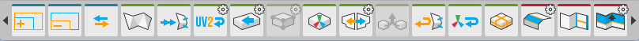
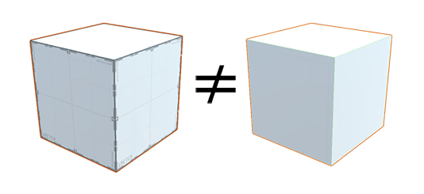

# Getting started 

You can access all of ProBuilder's editing tools from the [ProBuilder toolbar](toolbar.md), which dynamically adapts to your [Edit mode](edit-mode-toolbar.md) and your current selection.

Every toolbar button has a tooltip that shows a short summary about its use. Viewing tooltips is a great way to start learning about ProBuilder's functionality.

## Building and editing complex Meshes

ProBuilder Meshes act like regular GameObjects in Unity. You can apply Transform values to them and add components to them. They respond to the physics system, and you can animate them and attach scripts to them in order to control them. However, standard Unity Meshes are not the same as ProBuilder Meshes: you can't edit them with ProBuilder tools until you [convert them into ProBuilder objects](Object_ProBuilderize.md). 

The most common way to build a ProBuilder Mesh is to [create it](workflow-create.md) and [edit it](workflow-edit.md) entirely with ProBuilder tools. 

## Applying Materials and Vertex Colors

You can apply any Material to ProBuilder Meshes using the [Material Palette](material-tools.md), either on selected faces in [Element mode](edit-mode-toolbar.md) or across the entire object. 

You can also apply [Vertex Colors](workflow-vertexcolors.md) to your Mesh while you are still building the geometry. This can help easily identify parts of complex Meshes, such as the floor, or provide a little color while you are greyboxing.

### Editing UVs

ProBuilder provides [automatic UV unwrapping](auto-uvs-actions.md) and a complete [manual UV editor](manual-uvs-actions.md).

* __Auto UV__ mode lets you tweak basics like offset, tiling, and rotation, while ProBuilder handles the complex UV work automatically.

* __Manual UV__ mode gives you complete control of the UVs. With this workflow you can lay out your UV maps precisely.

You can use whichever you prefer, or a mix of both, even on the same Mesh.

For more information, see [Materials, Shaders, Textures, and UVs](workflow-texture-mapping.md)

## Exporting to other formats

You can also [export your ProBuilder Meshes](workflow-exporting.md) to several file formats, such as `.asset`, `.obj`, and `.stl`. Then you can reimport them into Unity and use them as Prefabs or spawn them. However, as soon as you convert a ProBuilder Mesh to the `.asset` format, it becomes a regular Unity GameObject, and you can't modify it with ProBuilder tools any more.

